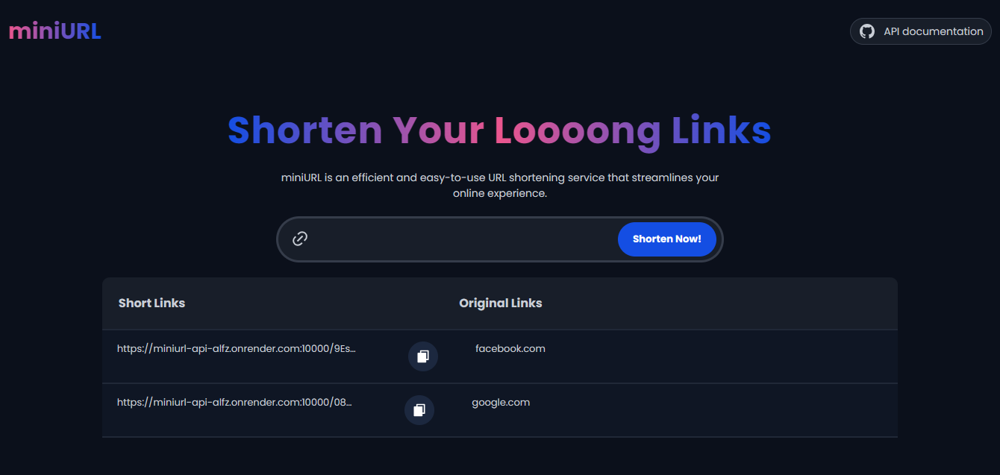

# miniURL - Link Shortening API

miniURL is a simple and easy-to-use link shortening API that allows you to shorten long URLs into more manageable ones.

- Live site: [miniUrl](https://miniurl-263q.onrender.com)

## Features

- **Easy-to-Use API**: Simply make a POST request to `https://miniurl-api-alfz.onrender.com/shorten` with the URL you want to shorten.

```javascript
fetch("https://miniurl-api-alfz.onrender.com/shorten", {
  method: "POST",
  headers: {
    "Content-Type": "application/json",
  },
  body: JSON.stringify({ url }),
});
```

Make sure to name the URL to be shortened as `url` in the request body.

- Response Format: The API returns data in the following format:
  json

```JSON
{
  "originalUrl": "google.com",
  "shortUrl": "https://miniurl-api-alfz.onrender.com/08gYVZ4Zcj",
  "status": 200
}
```

If the `status` returned is 500, it indicates an internal server error.

# Running the Project Locally with Docker

To run the miniURL project locally in a Dockerized environment, execute the following command:

`docker container run --rm -dp 8080:3000 devife076/miniurl-api:latest`

This command starts a Docker container using the `devife076/miniurl-api:latest` image and maps port `8080` on your local machine to port `3000` inside the container.

You can view the project in your browser: `127.0.0.1:8080`

# Additional Information

- **Design inspiration**: [mohamedhijas](https://www.figma.com/@mohammedhijas).
- **Customization**: Although miniURL generates short URLs automatically, future updates may include features for customizing shortened URLs and tracking link analytics.
- **Feedback**: We welcome any feedback or suggestions for improving miniURL. Feel free to reach out to us with any questions or concerns.

# Contact Us

For any inquiries or assistance, please contact us at [ifeoluwa sulaiman(dev-ife)](mailto:ifeoluwasulaiman30@gmail.com)
